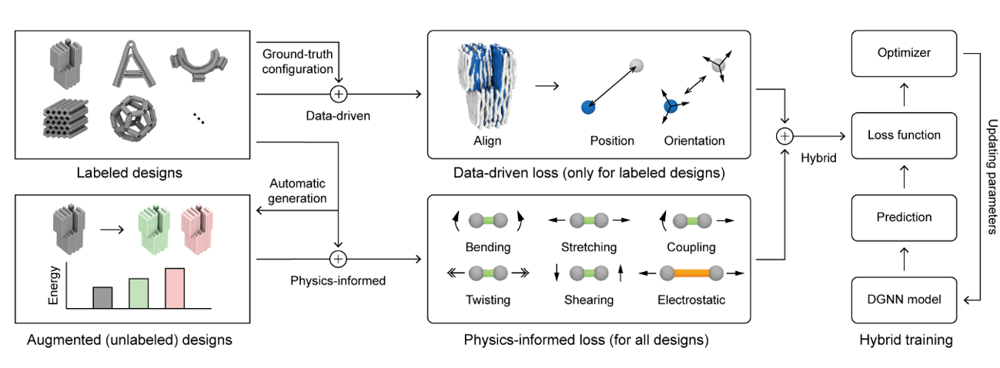

# Deep SNUPI
Deep SNUPI is a graph neural networks model to predict the three-dimensional shape of DNA origami assemblies. It was trained by hybrid data-driven and physics-informed approach.



## Prerequisite
- `python=3.9`
- `pytorch=2.0.0`
- `torch-geometric==2.3.1`
- `roma==1.3.2`
- `plotly==5.15.0`
- `streamlit==1.24.0` 

## Install via Conda (Recommended)
- Ensure your working-directory is in `DeepSNUPI` folder
- Create `DeepSNUPI` enviroment from environment.yml file
  ```bash
  conda env create -f env.yml
  ```
- Activate the environment
  ```bash
  conda activate DeepSNUPI
  ```

- Setup Pytorch 2.0.0 for Windows
  ```bash
  # CUDA 11.7
  conda install pytorch==2.0.0 torchvision==0.15.0 torchaudio==2.0.0 pytorch-cuda=11.7 -c pytorch -c nvidia
  # CPU Only
  conda install pytorch==2.0.0 torchvision==0.15.0 torchaudio==2.0.0 cpuonly -c pytorch
  ```

- Setup Pytorch-Geometric 2.3.1 for Windows
  ```bash
  pip install torch_geometric 
  # Dependencies CUDA 11.7
  pip install torch_scatter torch_sparse torch_cluster torch_spline_conv -f https://data.pyg.org/whl/torch-2.0.0+cu117.html
  # Dependencies CPU Only
  pip install torch_scatter torch_sparse torch_cluster torch_spline_conv -f https://data.pyg.org/whl/torch-2.0.0+cpu.html
  ```
## Hardware Requirements (Recommended)
For the best performances:
- ```Memory (GPU): 8GB```
- ```Memory (RAM): 128GB```


# Dataset
## Preprocessed input
We provide the preprocessed input examples in the `dataset` folder
  - The input examples for GNN predict: `dataset/origami/`

## Prepare your own DNA graph representation
You can also generate your own input by [SNUPI](https://github.com/SSDL-SNU/SNUPI/tree/master) from caDNAno design

# Instruction (win)
In this section we will demonstrate how to run Deep-SNUPI
  - Set up your working directory in `DeepSNUPI` folder from command window 
  - Activate `DeepSNUPI` enviroment, run:
    > *conda activate DeepSNUPI* <br/>

  - To get started using DeepSNUPI by the running the following command:
    > *streamlit run DeepSNUPI.py* <br/>
    
  - Seclect `GNN predict` tool for predictions
  - Upload your own input files or select examples input files from `dataset` folder
  - Click to choose prediction methods and take the predictions in output folder

# References and citing
The DGNN model and the approach behind it is described in our pre-print:
  > *Data-driven and physics-informed prediction of DNA origami shape using graph neural network* <br/>


